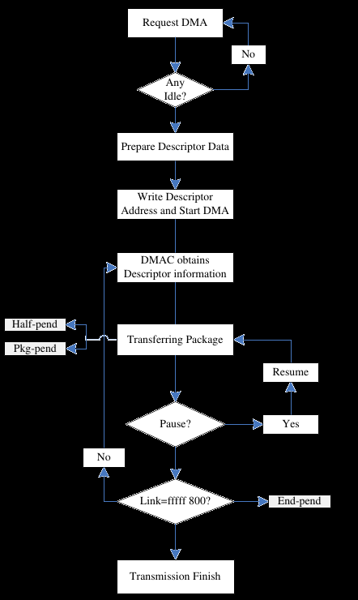

### How does memory work
https://en.wikipedia.org/wiki/Input%E2%80%93output_memory_management_unit

### Example of kernel driver
* From linux
https://github.com/Xilinx/linux-xlnx/blob/master/drivers/dma/dmatest.c

* Sunxi dma https://github.com/allwinner-zh/linux-3.4-sunxi/blob/master/drivers/dma/sunxi-dma.c

### HW (device tree)
https://github.com/torvalds/linux/blob/master/arch/arm/boot/dts/sun8i-h2-plus-orangepi-zero.dts

https://github.com/ARM-software/u-boot/blob/master/arch/arm/dts/sun8i-h3.dtsi

## Main documentation
https://linux-sunxi.org/H3#Variants

## Similar poject for RPI
* Example copy memory to memory
  https://github.com/Wallacoloo/Raspberry-Pi-DMA-Example/blob/master/dma-example.c

* Example copy IO to memory
https://github.com/Wallacoloo/Raspberry-Pi-DMA-Example/blob/master/dma-gpio.c

### Block Diagram of engine

## Current output
For now simple mem2mem works

### H2 data-sheet important pages
* Clock domains are visible on page: 88
* DMA bloc clock domain: 191

### Video codec
http://linux-sunxi.org/Cedrus