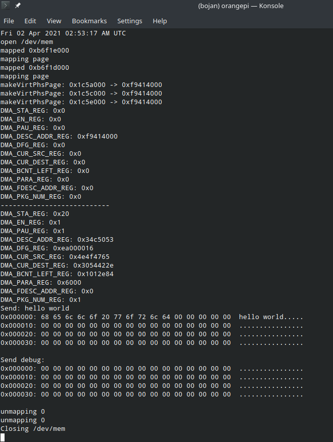

## Example of dma driver
https://github.com/Xilinx/linux-xlnx/blob/master/drivers/dma/dmatest.c

## OPI2 old repo
https://github.com/allwinner-zh/linux-3.4-sunxi/blob/master/drivers/dma/sunxi-dma.c

## HW
https://github.com/torvalds/linux/blob/master/arch/arm/boot/dts/sun8i-h2-plus-orangepi-zero.dts

https://github.com/ARM-software/u-boot/blob/master/arch/arm/dts/sun8i-h3.dtsi

## Random
https://en.wikipedia.org/wiki/Input%E2%80%93output_memory_management_unit

## Main documentation
https://linux-sunxi.org/H3#Variants

## Similar poject for RPI
https://github.com/Wallacoloo/Raspberry-Pi-DMA-Example/blob/master/dma-example.c

## Block Diagram of engine

## Current output

